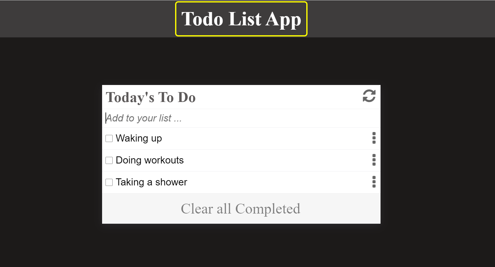

# TO Do List JS App

"To-do list" is a tool that helps to organize your day. It simply lists the things that you need to do and allows you to mark them as complete.

The present project is part of the Microverse curriculum Module 2 Block 3 Project. The main objective is putting hands on practice to build a web application using JavaSCript, DOM, Webpack, and HTML/CSS.

#### Home page

## Built With

- HTML5
- CSS3
- JavaScript  ES6
- WebPack

## Live Demo 

[Live Demo Link](https://boisterous-kleicha-602117.netlify.app/)

## Getting Started
To get a local copy of this exercice, Please follow these simple example steps.

1. Clone https://github.com/Carshy/To-Do-list-JS-App.git to your local machine.
2. Run npm install to install dependancies.
3. cd into the Restaurant-Page directory and navigate into the dist directory.
4. npm start to open a live page

That's it! You can play with it as you wish :smile:

## Authors

👤 **Collins Musoko**

- GitHub: [@Collins Musoko](https://github.com/Carshy)
- Twitter: [@CarshyCollins](https://twitter.com/CarshyCollins)
- Linkedin: [Collins Musoko](https://www.linkedin.com/in/collins-musoko-864881120/)

## Show your support

Give a ⭐️ if you like this project!

## 🤝 Contributing

Contributions, issues, and feature requests are welcome!

## Acknowledgments

## Acknowledgments

- Thanks to the Microverse team for the great curriculum 🙌.
- Thanks to Code Reviewers for the insightful feedback ⚡.
- Hat Tip to My coding partners, morning session team, and standup team for support and encouragement 🏹
- My family's support 🙌

## 📝 License

This project is [MIT](./MIT.md) licensed.
